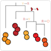

  
</p?
 

# EPIC-IC

#### Welcome to the *Epidemiology Platform for Infectious-disease Control*, hosted in the Department of Infectious Disease Epidemiology in Imperial College London. This org will house our new epidemiology repos for the Department of Infectious Diseases in the School of Public Health, starting from July 2026.

## Related orgs, current and recent.

<table>
  <tr>
    <td width="120">
      
    </td>
    <td>
      <b>mrc-ide</b> 
      Repos from the MRC Centre for Global Infectious
      Disease Analysis (MRC-GIDA) which existed from 2010 until 2026, will
      remain and be maintained here.
    </td>
  </tr>
  <tr>
    <td width="120">
      
    </td>
    <td>
      <b>vimc</b> 
      The Vaccine Impact and Modelling Consortium, co-ordinated at Imperial,
      is an international community of modellers providing high-quality estimates
      of the public health impact of vaccination, to inform and improve decision making.
    </td>
  </tr>
  <tr>
    <td width="120">
      
    </td>
    <td>
      <b>jameel-institute</b> 
      The Jameel Institute, within the School of Public Health was founded in
      October 2019, with a mission to combat disease threats worldwide.
    </td>
  </tr>
  <tr>
    <td width="120">
      
    </td>
    <td>
      <b>bacpop</b> 
      Pathogen Informatics and Modelling, in the
      Bacterial Evolutionary Epidemiology Group in the School of Health
      at Imperial.
    </td>
  </tr>
  <tr>
    <td width="120">
      
    </td>
    <td>
      <b>reside-ic</b> 
      The Research Software Engineering team in the School of Public Health.
    </td>
  </tr>
</table>

## Historic orgs

<table>
  <tr>
    <td width="120">
      
    </td>
    <td>
      <b>ncov-ic</b> 
      Our repos relating to the Coronavirus 2019 Pandemic are here.
    </td>
  </tr>
  <tr>
    <td width="120">
      
    </td>
    <td>
      <b>imperialebola2018</b> 
      Repos relating to the Ebola epidemic in DRC in 2018 are in this org.
    </td>
  </tr>
</table>
